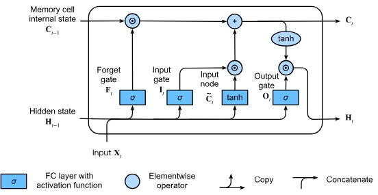
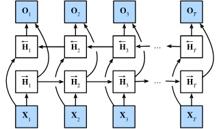
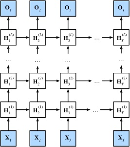
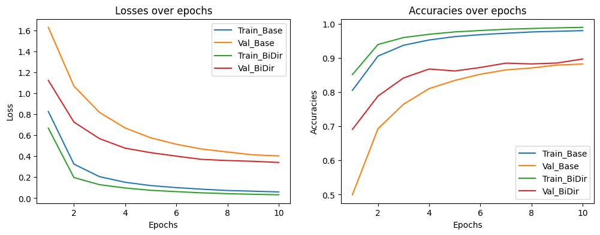
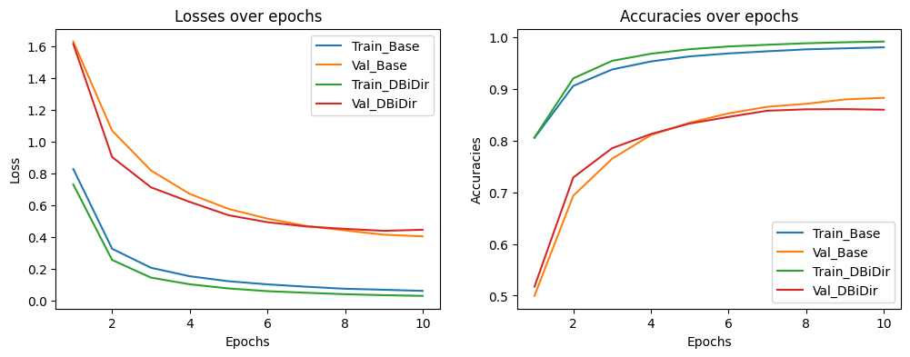

# Part of Speech Tagging
Perform Part-of-Speech tagging using variations of LSTM models, on Universal Dependencies English Web Treebank **(UDPOS) dataset**. I used this project to implement these architectures from scratch. As a result, I am able to fully understand the inner workings of each architecture and how they are built on top of one another.


## 1. Dataset

UPDOS is a parsed text corpus dataset that clarifies syntactic or semantic sentence structure.

## 2. Overview of Architectures

Architectural diagrams are collected from [Dive into Deep Learning](https://d2l.ai/) book.

### 2.1. LSTM

LSTM or Long Short Term Memory is a modern RNN architecture. It has 3 gates for performing it's inner operations. It uses memory cell states to keep track of context and uses the gates to update these memory cells. 

The 3 gates are calculated separate weights and biases as below:

```math
\begin{split}\begin{aligned}
\mathbf{I}_t &= \sigma(\mathbf{X}_t \mathbf{W}_{\textrm{xi}} + \mathbf{H}_{t-1} \mathbf{W}_{\textrm{hi}} + \mathbf{b}_\textrm{i})\\
\mathbf{F}_t &= \sigma(\mathbf{X}_t \mathbf{W}_{\textrm{xf}} + \mathbf{H}_{t-1} \mathbf{W}_{\textrm{hf}} + \mathbf{b}_\textrm{f})\\
\mathbf{O}_t &= \sigma(\mathbf{X}_t \mathbf{W}_{\textrm{xo}} + \mathbf{H}_{t-1} \mathbf{W}_{\textrm{ho}} + \mathbf{b}_\textrm{o})
\end{aligned}\end{split}
```

From current step, a temporary **Input Node** tensor is created 

```math
\tilde{\mathbf{C}}_t = \textrm{tanh}(\mathbf{X}_t \mathbf{W}_{\textrm{xc}} + \mathbf{H}_{t-1} \mathbf{W}_{\textrm{hc}} + \mathbf{b}_\textrm{c})
```

Then the gates and the input node is used, at time step t, to calculate the memory cell 

```math
\mathbf{C}_t = \mathbf{F}_t \odot \mathbf{C}_{t-1} + \mathbf{I}_t \odot \tilde{\mathbf{C}}_t
```

and hidden state 

```math
\mathbf{H}_t = \mathbf{O}_t \odot \tanh(\mathbf{C}_t)
```

Visually the operations form the following diagram:

<center></center>

Compared to vanilla RNNs, LSTM are able to capture and retain context for longer sequence of tokens. However, they require 4 times more memory to do so. 

### 2.2. Bi-directional LSTM

A bidirectional RNN architecture basically processes the sequence of data twice, once from left to right and another time from right to left. It uses two separate sets of parameters to keep track of the hidden states. Afterwards, the hidden states are concatenated. 

Mathematically,

```math
\begin{split}\begin{aligned}
\overrightarrow{\mathbf{H}}_t &= \phi(\mathbf{X}_t \mathbf{W}_{\textrm{xh}}^{(f)} + \overrightarrow{\mathbf{H}}_{t-1} \mathbf{W}_{\textrm{hh}}^{(f)}  + \mathbf{b}_\textrm{h}^{(f)})\\
\overleftarrow{\mathbf{H}}_t &= \phi(\mathbf{X}_t \mathbf{W}_{\textrm{xh}}^{(b)} + \overleftarrow{\mathbf{H}}_{t+1} \mathbf{W}_{\textrm{hh}}^{(b)}  + \mathbf{b}_\textrm{h}^{(b)})
\end{aligned}\end{split}
```


Visually,

<center></center>

The benefit of this architecture is that it captures information not only from the previous words, but also from the next words. The concept stays the same for a bidirectional LSTM model as well. Except the parameters and inner workings change, instead of using two separate RNN modules for forward and backward passes, we use two LSTM models.

### 2.3. Deep LSTM

A multi-layer LSTM model takes the hidden states of the previous layer as input for the next layer. In the beginning, embeddings are used as the input for the first layer. Then the first layer produces the first set of hidden states. These are then treated as input for the second layer. 

Mathematically,

```math
\mathbf{H}_t^{(l)} = \phi_l(\mathbf{H}_t^{(l-1)} \mathbf{W}_{\textrm{xh}}^{(l)} + \mathbf{H}_{t-1}^{(l)} \mathbf{W}_{\textrm{hh}}^{(l)}  + \mathbf{b}_\textrm{h}^{(l)})
```

Visually,

<center></center>

The idea is that like multi-layer perceptrons, multi-layer RNNs will learn something new in each layer and get progressively better at learning patterns in the underlying data.

## 3. Architecture Comparison

Bi-directionality adds a significant improvement to the base LSTM layer. This is evident in the following graph:

<center></center>

The bi-lstm model's inference time is nearly twice as long, but is worth the additional performance benefits. However, this is not true for the deep bi-lstm model. Because it doesn't achieve a significant performance improvement. Moreover, its inference time is nearly 4 times that of the base model.

<center></center>


# Acknowledgements
1. My Natural Language Processing course instructor [Hangfeng He](https://hornhehhf.github.io/).
2. [Dive into Deep Learning](https://d2l.ai/) authors and community
